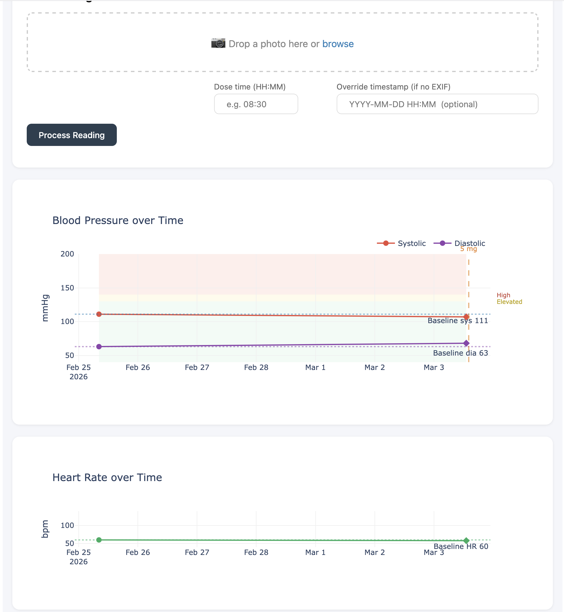

# BP Tracker

> 🤖 *This README was written by Claude Code. If it sounds suspiciously well-structured and slightly too enthusiastic about CSV files, that's why.*

> A personal experiment in human–AI collaboration, built entirely through conversation with **Claude Code**.

This is a web-based blood pressure tracking system. Open the dashboard on your phone, upload a photo of your BP monitor, and the app does the rest — reads the display via Claude vision API, logs the values, and renders a live chart. Hosted on your own domain, protected by a password.

---



---

## How it works

```
📱 Open bp.utkubilen.de on iPhone
        ↓
🔐 Log in (basic auth)
        ↓
📷 Upload photo of BP monitor
        ↓
🤖 Claude vision API reads the display
   → systolic, diastolic, heart rate, AI comment
        ↓
📅 Timestamp extracted from photo EXIF
   (prompts for manual entry if missing)
        ↓
📄 New row appended to data/readings.csv
        ↓
📊 Dashboard auto-refreshes
```

---

## Features

- **Browser-based upload** — works from any device, no app needed
- **Claude vision extraction** — reads the monitor display automatically, no typing
- **EXIF-first timestamps** — uses when the photo was actually taken
- **Dose tracking per reading** — logs mg amount with each entry; dose changes appear as vertical markers on the chart
- **Colour-coded BP zones** — green / yellow / red clinical thresholds
- **Baseline reference lines** — every reading compared against your personal baseline
- **AI hover tooltips** — each data point carries a short clinical observation
- **CSV download** — export your data any time from the dashboard
- **User management** — add or remove dashboard users without touching the server
- **Auto-refresh** — dashboard polls every 15 seconds
- **Hand-editable CSV** — plain text, edit freely in any spreadsheet app

---

## Architecture

Everything runs on a VPS. No local processing required.

```
iPhone browser
    ↓  HTTPS
nginx (bp.utkubilen.de)
    ↓  basic auth
    ↓  reverse proxy → :8050
Dash app (gunicorn)
    ↓  Claude vision API
data/readings.csv
```

---

## Project structure

```
bp-tracker/
├── dashboard.py            ← Dash app: upload, charts, download, user management
├── watcher.py              ← optional local folder watcher (alternative workflow)
├── config.py               ← all settings in one place
├── deploy/
│   ├── nginx.conf          ← nginx reverse proxy + basic auth config
│   ├── bp-tracker.service  ← systemd unit (keeps gunicorn alive)
│   └── setup_vps.sh        ← one-shot VPS setup script
├── data/
│   ├── readings.csv        ← your data (gitignored)
│   ├── readings.example.csv
│   └── .htpasswd           ← auth users (gitignored)
├── watch_folder/           ← drop photos here (local watcher only)
├── pyproject.toml          ← dependencies (managed by uv)
├── uv.lock                 ← exact pinned versions
├── .env.example            ← API key template
└── .python-version         ← Python 3.12
```

---

## Setup

### Requirements
- A VPS running Ubuntu/Debian with nginx installed
- A domain pointing at your VPS (DNS A record)
- An [Anthropic API key](https://console.anthropic.com)

### 1. Point your subdomain at the VPS

In your DNS provider (e.g. Namecheap → Advanced DNS), add:

| Type | Host | Value |
|---|---|---|
| A Record | `bp` | `your.vps.ip` |

### 2. Run the setup script on the VPS

```bash
curl -s https://raw.githubusercontent.com/UtkuBilenDemir/bp_tracker/main/deploy/setup_vps.sh -o setup_vps.sh
sudo bash setup_vps.sh
```

The script will:
- Install dependencies (nginx, certbot, uv)
- Clone the repo to `/home/ubd/bp_tracker`
- Ask for your Anthropic API key
- Create the initial dashboard user
- Configure nginx with HTTPS via Let's Encrypt
- Start the app as a systemd service

### 3. Configure your baseline

Open `config.py` and set your values:

```python
BASELINE_SYSTOLIC  = 111   # mmHg
BASELINE_DIASTOLIC = 63    # mmHg
BASELINE_HR        = 60    # bpm
CURRENT_DOSE_MG    = 5     # default pre-fill in upload form
```

### 4. Copy your CSV (if migrating)

```bash
scp data/readings.csv user@your.vps.ip:/home/ubd/bp_tracker/data/readings.csv
```

---

## Usage

Open your dashboard URL in any browser. Log in, upload a photo, fill in dose info, hit **Process Reading**.

### Changing the dose
The upload form has a **Dose (mg)** field pre-filled with the current default. Just change the number when your dose changes — it's saved per reading. The chart draws a vertical orange line whenever the dose changes between readings.

When you settle on a new long-term dose, update `CURRENT_DOSE_MG` in `config.py` so the form always pre-fills correctly.

### Adding users
Scroll to the **Access** section at the bottom of the dashboard. Enter a username and password and click Add. No server access required.

### Downloading your data
Click **⬇ Download CSV** in the top right — saves your full readings as a CSV file.

---

## CSV format

Plain CSV, hand-editable. One row per reading.

```
timestamp,systolic,diastolic,heart_rate,dose_taken,dose_mg,dose_time,photo_filename,ai_comment
2026-02-25 08:14:00,111,63,60,False,0,,,Baseline reading. BP and HR well within normal range.
2026-03-03 13:05:00,107,68,58,True,5,,IMG_8485.HEIC,Slightly below baseline — good sign.
```

See `data/readings.example.csv` for a fuller example.

---

## Dashboard reference

| Element | Meaning |
|---|---|
| Red line | Systolic pressure |
| Purple line | Diastolic pressure |
| Green line | Heart rate (lower chart) |
| ◆ Diamond marker | Reading taken with a dose |
| ● Circle marker | Reading taken without a dose |
| Orange dashed line | Dose change |
| Green band | Normal range |
| Yellow band | Elevated (>130/85 mmHg) |
| Red band | High (>140/90 mmHg) |
| Dotted lines | Your personal baseline |
| Hover tooltip | All values + dose + AI comment |

---

## Privacy

- All data stays on **your VPS** — no third-party storage
- Photos are processed by Anthropic's API and not stored — review their [privacy policy](https://www.anthropic.com/privacy)
- `readings.csv` and `.htpasswd` are gitignored and never committed
- Dashboard is protected by HTTP Basic Auth over HTTPS

---

## Built with

- [Anthropic Claude](https://anthropic.com) — vision extraction + AI comments
- [Plotly / Dash](https://dash.plotly.com) — interactive dashboard + file upload
- [passlib](https://passlib.readthedocs.io) — htpasswd user management
- [Pillow](https://python-pillow.org) + [pillow-heif](https://github.com/bigcat88/pillow_heif) — image handling + HEIC support
- [pandas](https://pandas.pydata.org) — CSV handling
- [gunicorn](https://gunicorn.org) — production WSGI server
- [uv](https://github.com/astral-sh/uv) — environment management

---

*Built through conversation with [Claude Code](https://claude.ai/claude-code) — Anthropic's AI coding assistant.*
